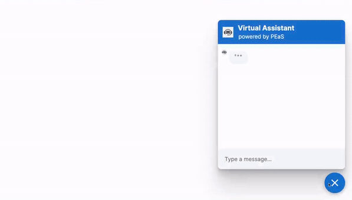

# ChatBot Response Generator

This is an open-source project aimed at creating a response generator for chatbots. It allows developers to define various types of responses and integrate them into their chatbot applications.

## Tech/Framework Used

Built with Python, Flask, and NLTK library for natural language processing.

## Screenshots and Demo

<div align="center">
  
</div>

---

## Tech/Framework Used

- Python
- Rasa Framework

## Getting Started

To get started with this project, follow these steps:

1. Clone the repository:

   ```
   git clone https://github.com/your-username/rasa-response-generator.git
   ```

2. Install dependencies:

   ```
   pip install -r requirements.txt
   ```

3. Define Responses: Edit the `responses.py` file to define your custom responses.

4. Integrate with Rasa: Integrate the generated responses into your Rasa chatbot by importing the `responses.py` module.

5. Train and Run: Train your Rasa chatbot using the integrated responses and run it to start interacting with users.

## Contributing

Contributions are welcome! If you'd like to contribute to this project, please follow these steps:

1. Fork the repository.
2. Create a new branch (`git checkout -b feature/new-feature`).
3. Make your changes and commit them (`git commit -am 'Add new feature'`).
4. Push to the branch (`git push origin feature/new-feature`).
5. Create a new Pull Request.


## Acknowledgements

- Thanks to [Rasa](https://rasa.com/) for providing the framework for building conversational AI chatbots.


